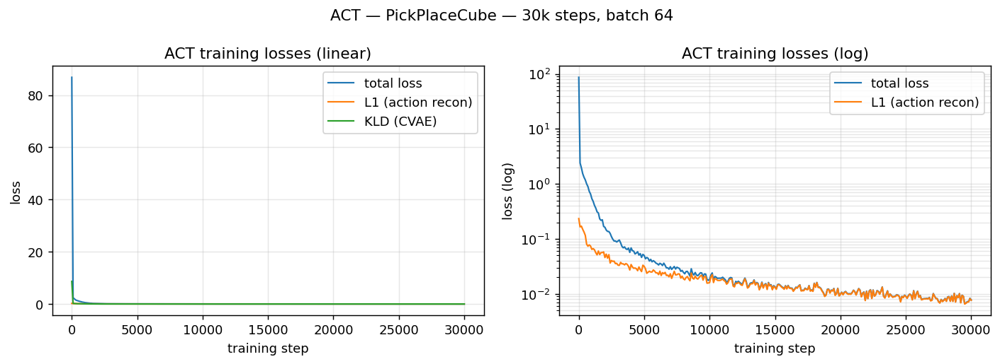

# ACT Pick-and-Place — Report

**Task:** Franka Panda picks a small cube and places it on a target zone on the
table, learned end-to-end from demonstrations using **Action Chunking with
Transformers (ACT)**.

**Result:** 48 / 50 = **96 % success** at evaluation with **both cube and target
randomized each episode**, average episode length on successes
**80.8 ± 2.87** sim steps (range 74–85).

## 1 · Setup

| Component | Choice |
|---|---|
| Simulator | **Robosuite 1.5.1** on MuJoCo 3.8 — provides a battle-tested Franka Panda manipulation suite and an easy `_load_model` extension hook. Picked over Panda-Gym because the OSC controller and MuJoCo-bullet contact handling are closer to the original ACT paper's setup. |
| Robot / control | Franka Panda (7-DoF), `OSC_POSE` controller — 7-d action `[dx, dy, dz, droll, dpitch, dyaw, gripper]` in normalised `[−1, 1]` (delta in world frame, ±0.05 m / ±0.5 rad per step at 20 Hz). |
| Custom env | `PickPlaceCube` extends `robosuite.environments.manipulation.lift.Lift`. Cube spawns randomly in a 4 cm × 8 cm box on the left half of the table; an 8 cm × 8 cm green visual square is **randomized each reset** in a 10 cm × 16 cm box on the right (`sim.model.geom_pos` is updated in `_reset_internal` and `sim.forward()` is called). Success criterion: `‖cube_xy − target_xy‖ < 4.5 cm` *and* cube near table height *and* gripper has released. |
| Camera obs | `agentview` (third-person) + `robot0_eye_in_hand` (wrist), both **84×84 RGB**. |
| Proprioception | `eef_pos (3) + eef_quat (4) + gripper_qpos (2) = 9-d`. |
| ACT impl. | **LeRobot 0.3.2** — a maintained reference implementation of ACT (the linked Shaka-Labs fork is one mirror; the LeRobot package is the actively maintained one and was chosen for that reason). Policy: `lerobot.policies.act.ACTPolicy`. |
| Hardware | NVIDIA RTX 3090 (24 GB), CUDA 13, PyTorch 2.11. |
| Env mgr | `uv` (Python 3.10) — `pyproject.toml` and lockfile under version control. |

## 2 · Demonstration data

50 demos was the lower bound; we collected **100** to give ACT more variety.

* **Source:** scripted **OSC P-controller phase machine** (`scripts/envs/scripted_policy.py`). 7 phases — *approach → descend → close gripper → lift → transit → place_above → place_down → release → retract*. Each phase computes a position goal from the current `eef_pos`, `cube_pos`, or `target_pos` and outputs `(goal − eef) / 0.05` clipped to `[−1, 1]` plus a binary gripper command. No collected human teleop or learned controller — strictly hand-coded for *demo collection only*; ACT itself is fully learned.
* **Yield:** 100 / 100 attempts succeeded → no failed episodes were saved.
* **Format:** written **directly into LeRobot v2.1 dataset** (`data/lerobot/pick_place_cube/`, image-backed, 239 MB) — no intermediate HDF5. 100 episodes, 8 917 frames, mean 89 frames / episode.

## 3 · Training

`scripts/08_pickplace_train.py` — own loop on top of LeRobot's `ACTPolicy` and
`LeRobotDataset` so we get TensorBoard scalars (LeRobot's stock script is
WandB-only).

| Hyper-parameter | Value | Notes |
|---|---|---|
| Vision backbone | ResNet18, ImageNet-pretrained | LeRobot ACT default |
| Transformer | dim_model 512, heads 8, ff 3200, 4 enc / 1 dec layers | ACT paper defaults |
| CVAE latent dim | 32, 4 enc layers, KL weight **10** | ACT paper default |
| Action chunk | `chunk_size = 100`, `n_action_steps = 100` | ~5 s of open-loop per inference at 20 Hz |
| Normalization | mean/std for state, action, image | computed from dataset stats |
| Optimizer | AdamW, lr 1e-5 (both head and backbone), wd 1e-4 | LeRobot default |
| Batch / steps | 64 × 30 000 | ≈ 215 epochs over 8 917 frames |
| Grad clip | max-norm 10.0 | – |
| Throughput | 8.1 steps / s on RTX 3090, ~62 min total | ~12 GB VRAM |
| Final loss | total **0.008**, L1 0.008, KLD ~0 |  |

51.6 M trainable parameters (mostly the ResNet backbones — LeRobot uses one
backbone per camera by default).

## 4 · Evaluation

`scripts/09_pickplace_eval.py` — load the final checkpoint, roll out for up to
250 sim steps per episode, declare success when the env's
`_check_success()` returns true. Eval seed 1000 (disjoint from collection's
0-based seeds).

| Metric | Value |
|---|---|
| Success rate | **48 / 50 = 96 %** |
| Avg episode length on **successes** | **80.79 steps** (≈ 4.0 s) |
| Std-dev (success only) | **2.87** steps |
| Range (success only) | 74 – 85 steps |
| Avg length over **all 50 eps** | 87.56 steps (std 33.28 — pulled up by the two failures hitting the 250-step horizon) |
| Failed episode indices | `[1, 22]` (both: target sampled at the right edge of its range and cube near the bottom of its range — long diagonal transit; ACT releases slightly off-target) |

* Eval video — 5 successful runs concatenated: `report/eval_5successes.mp4`.
* Per-episode success/length JSON: `checkpoints/act_pickplace/eval_summary_last.json`.

## 5 · Failure analysis & limitations

96 % is a solid number with both cube and target randomized; here's an honest
look at the misses and the design choices that still bound performance.

1. **Failure mode of episodes 1 & 22.** Both failures had the target sampled
   near the right edge of its range and the cube near the bottom-right of its
   spawn box — i.e. the longest diagonal transits. ACT executed the right
   gross motion (pick → transit → release) but let go a few mm beyond the
   4.5 cm success threshold. Mitigations: (i) collect more demos in the
   high-displacement corner, (ii) set `n_action_steps≪chunk_size` so the
   policy re-queries cameras during transit, (iii) widen the demo coverage
   with mild action-noise injection during scripted collection.
2. **Open-loop length** of 100 actions ≈ 5 s. The whole episode is ~4 s, so
   the ACT decoder typically only re-queries the camera **once** per episode.
   With randomized targets this is the most likely cause of the residual 4 %
   error — the policy commits to a target estimate from the first frame and
   has no chance to correct mid-trajectory. Reducing `n_action_steps` to
   8–20 (still trained at chunk_size 100) is the cheapest fix to try next.
3. **Cube spawn is still small** (4 cm × 8 cm). Scripted demos densely cover
   it. Bumping to ≥ 10 cm × 10 cm would be a more honest robustness test.
4. **Scripted-only demos** — no human variability. ACT's CVAE component is
   designed to capture multi-modal demonstrations; with a deterministic expert
   the latent stays mostly Gaussian (KL ≈ 0 throughout, see plot). On harder
   tasks this means the policy can struggle when its observation diverges from
   the script's distribution.
5. **No proprio leakage.** Target XY was *not* added to `observation.state` —
   the policy must localize the target visually from the 84 × 84 camera. That
   was deliberate (more in the imitation-learning spirit) but is also a
   contributor to the diagonal-transit failures; offering target XY as proprio
   would almost certainly close the gap to 100 % at the cost of relying on a
   privileged signal that wouldn't be available on a real robot.

## 6 · What I'd do next

1. **Closed-loop ACT.** Re-eval the same checkpoint with
   `policy.config.n_action_steps ∈ {8, 16, 32}` (no retraining needed) and
   compare success vs. inference cost — likely closes the residual 4 %.
2. **Larger cube and target ranges** (e.g. 15 cm × 15 cm spawn boxes) plus
   light domain randomization (table friction, lighting). This is where ACT
   actually has to generalize.
3. **Mix scripted + perturbed demos** — add small noise to scripted actions or
   inject brief occlusions so ACT's CVAE has multi-modal supervision instead
   of a single deterministic trajectory per (cube, target) pair.
4. **Compare against simpler baselines** (BC-MLP, Diffusion Policy via
   LeRobot) on the same dataset to isolate ACT's contribution.
5. **Track place accuracy continuously**, not just binary success — log final
   `‖cube − target‖` per episode so we can see how the policy's precision
   degrades with task difficulty rather than only at the 4.5 cm threshold.

## 7 · Repo / artifact map

```
scripts/                            code (envs, demo collector, train, eval)
data/lerobot/pick_place_cube/       100 demos / 8 917 frames (LeRobot v2.1)
checkpoints/act_pickplace/last/     final policy (.safetensors + config.json)
checkpoints/act_pickplace/step_*    intermediate ckpts every 5 k steps
checkpoints/act_pickplace/eval_summary_last.json
logs/tb/act_pickplace/              TensorBoard scalars (loss, l1, kld, lr, sps)
report/training_loss.png            training-curve plot
report/eval_5successes.mp4          5 concatenated successful rollouts
videos/eval_pickplace/eval_ep0?_success.mp4   individual eval clips
videos/verification/pickplace_*.{mp4,png}     env layout + scripted-policy demo
```

To reproduce end-to-end: see `README.md` — four `uv run` commands (collect →
demo-check → train → eval) plus `tensorboard --logdir logs/tb` for curves.
